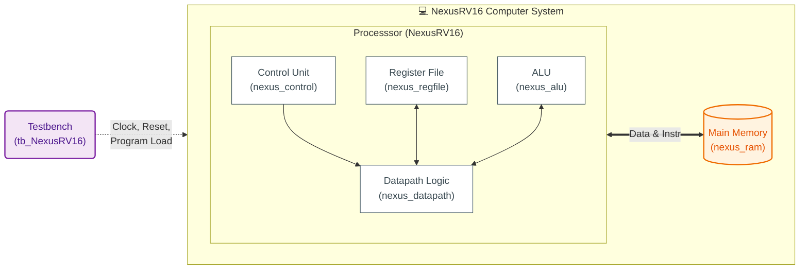

# NexusRV16: 16-bit Pipelined RISC Processor

   

**NexusRV16**, eğitim ve gömülü sistemler için tasarlanmış, yüksek performanslı **16-bit 2-Aşamalı Pipelined (Boru Hattı)** RISC işlemci mimarisidir. Verilog HDL kullanılarak geliştirilmiş ve kapsamlı testbench senaryoları ile doğrulanmıştır.

Bu proje, modern bilgisayar mimarisi prensiplerini (Register Forwarding, Hazard Detection, Pipeline Stalling) minimalist bir yapıda uygular.

---

## 🎨 High-Level Architecture (Renkli Blok Şeması)

Aşağıdaki diyagram, NexusRV16'nın iç veri yollarını, kontrol mantığını ve bellek etkileşimini göstermektedir.



---

## 🚀 Key Features

*   **Mimari:** 16-bit RISC (Reduced Instruction Set Computer).
*   **Pipeline:** 2-Aşamalı (Fetch/Decode ve Execute/Writeback).
*   **Registers:** 8 adet 16-bit Genel Amaçlı Yazmaç (R0-R7).
*   **Hazards Çözümü:**
    *   **Data Hazard:** *Address Forwarding* ve *Load-Use Stall* mekanizmaları.
    *   **Control Hazard:** Branch tahmini ve *Pipeline Flushing*.
    *   **Structural Hazard:** Memory access çakışmaları için *Automatic NOP Insertion*.
*   **Bellek:** 64KB Adreslenebilir Alan (Unified Memory Architecture).
*   **Test:** 14 farklı senaryoyu kapsayan %100 doğrulama oranı.

---

## 📂 Project Structure

Proje, kolay entegrasyon için modüler bir yapıda düzenlenmiştir:

| Dosya Adı | Açıklama |
| :--- | :--- |
| `NexusRV16.v` | **Top Module.** CPU ve RAM'i birleştiren sistem modülü. |
| `nexus_cpu_pipeline.v` | İşlemci çekirdeği. Pipeline ve NOP mantığını yönetir. |
| `nexus_datapath.v` | Veri yolu. PC, Muxlar ve ALU bağlantılarını içerir. |
| `nexus_control.v` | Kontrol birimi. Stall ve Flush sinyallerini üretir. |
| `nexus_alu.v` | Aritmetik Mantık Birimi (ADD, SUB, SHL, Logical Ops). |
| `nexus_regfile.v` | 8x16-bit Register File. |
| `nexus_ram.v` | Simülasyon için 64KB Bellek Modülü. |
| `tb_NexusRV16.v` | **Comprehensive Testbench.** Tüm ISA'yı test eder. |

---

## ⚡ Instruction Set Architecture (ISA)

NexusRV16, 16-bit sabit uzunluklu komut yapısını kullanır.

| Type | Instruction | Opcode (Hex) | Description | Example |
| :--- | :--- | :--- | :--- | :--- |
| **Arithmetic** | `ADD` | `0x0` | Toplama | `ADD R0, R1` |
| | `SUB` | `0x1` | Çıkarma | `SUB R0, R2` |
| | `INC` | `0x9` | Arttırma | `INC R3` |
| | `DEC` | `0xC` | Azaltma | `DEC R3` |
| **Logic** | `AND` | `0x2` | Mantıksal VE | `AND R1, R2` |
| | `OR` | `0x3` | Mantıksal VEYA | `OR R1, R2` |
| | `XOR` | `0x4` | Mantıksal XOR | `XOR R1, R2` |
| | `NOT` | `0x5` | Mantıksal TERS | `NOT R1` |
| **Shift** | `SHL` | `0x6` | Sola Kaydırma | `SHL R1, R2` |
| | `SHR` | `0x7` | Sağa Kaydırma | `SHR R1, R2` |
| **Data Transfer** | `LDI` | `0xA` | Sabit Yükle (Immediate) | `LDI R0, #10` |
| | `LDR` | `0xB` | Bellekten Oku (Load) | `LDR R1, [Addr]` |
| | `STR` | `0xC` | Belleğe Yaz (Store) | `STR R2, [Addr]` |
| **Control Flow** | `JMP` | `0xE0` | Şartsız Dallanma | `JMP +4` |
| | `BEQ` | `0xE4` | Eşitse Dallan (Zero Flag) | `BEQ +6` |
| | `BNE` | `0xE8` | Eşit Değilse Dallan | `BNE -2` |
| | `HLT` | `0xFE` | İşlemciyi Durdur | `HLT` |

---

## 🛠️ Simulation & Verification

Proje, Vivado Simulator üzerinde kapsamlı bir şekilde test edilmiştir.

### Test Sonuçları (tb_NexusRV16.v)
Tüm test grupları başarıyla geçmiştir:

```text
================================================================
  TEST SUMMARY
================================================================
   Passed : 14
   Failed : 0
   Total  : 14
================================================================
  *** ALL TESTS PASSED! ***
  NexusRV16 Pipeline Processor fully operational.
```

### Nasıl Çalıştırılır?
1.  **Vivado**'yu açın ve yeni bir proje oluşturun.
2.  `sources` klasöründeki tüm `.v` dosyalarını "Design Sources" olarak ekleyin.
3.  `testbench` klasöründeki `tb_NexusRV16.v` dosyasını "Simulation Sources" olarak ekleyin.
4.  Simülasyon ayarlarından `tb_NexusRV16` modülünü "Top Module" olarak seçin.
5.  **Run Simulation > Run All** komutunu çalıştırın.

---

## 👤 Author

**Musa**  
*Computer Architecture Engineer & FPGA Developer*  
January 2026
